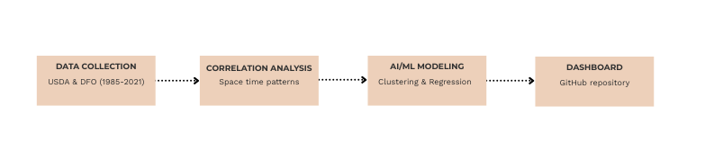

# Flood-Related Crop Loss Analysis in FLorida

An analysis of the relationship between flood events and agricultural crop losses across Florida counties, from 1985 to 2021, using clustering algorithms and regression models to identify spatial patterns and crop-specific vulnerability. 

## Overview 

This project analyzes crop loss severity across Florida counties by combining flood event records, from the DFO (Dartmouth Flood Observatory), with USDA RMA (Risk Management Agency) crop indemnity data. Through k-means clustering (1D, 2D, and 5D), the analysis identifies high-loss counties, the specific crop types driving crop yield losses, and distinct loss profiles based on financial impact versus damaged acreage. 



## Getting Started

### Clone the repository

- git clone https://github.com/pmad06/flood-related-crop-losses
- cd flood-related-crop-losses


### Install dependencies

- pip install -r requirements.txt

## Repository Structure

```
flood-related-crop-losses/
├─ data/
│  ├─ florida_flood(in).csv
│  ├─ practice_by_county_2d_acres_clusters.csv
│  ├─ practice_by_county_5d_clusters.csv
│  ├─ practice_by_county_final_with_clusters.csv
│  └─ practice_by_county_final(in).csv
│
├─ scripts/
│  ├─ 1d_analysis/
│  │  ├─ kmeans_analysis.py
│  │  └─ cause_of_loss_analysis.py
│  ├─ 2d_analysis/
│  │  ├─ net_acres.py
│  │  ├─ box_plot.py
│  │  └─ pie_chart.py
│  └─ 5d_analysis/
│     └─ kmeans_5d_analysis.py
│
├─ figures/
│  └─ (output plots: maps, scatter plots, boxplots, bar charts)
│
├─ requirements.txt
└─ README.md
```

## Workflow Description 

### 1. Data Collection & Organization (`data/`)
Flood event data was obtained from the Dartmouth Flood Observatory (DFO) and crop yield loss data was obtained from USDA RMA for all Florida counties from 1985-2021. 

### 2. 1D Clustering (`scripts/1d_analysis/`)
Clusters counties by total crop indemnity alone (k=3) to identify low/moderate/high loss severity tiers, then identifies which commodities (crop types) drive losses in high-tier counties. 

### 3. 2D Clustering (`scripts/2d_analysis\`)
Clusters counties using both total indemnity and damaged acreage, revealing two distinct loss profiles: high-value and low-acreage vs. widespread and low-intensity damage. 

### 4. 5D Clustering (`scripts/5d_analysis/`)
Expands clustering to five variables: indemnity, damaged acres, percent irrigated, planted acres, and loss ratio. Allowed for a multi-dimensional view of county-level risk.

## Usage Notes and Limitations 

- This analysis provides county-level aggregated estimates, rather than farm-level losses.
- Input data reflects/insured losses only.
- Not intended for real-time flood damage prediction.

## Data Sources & Citation 

- Dartmouth Flood Observatory. (n.d). *Global Flood Records* [Data set]. Zenodo. https://doi.org/10.5281/zenodo.19288170
- USDA Risk Management Agency. (n.d). *Cause of Loss Historical Data Files* [Data set]. https://www.rma.usda.gov/tools-reports/summary-of-business/cause-loss

## Acknowledgements 

This work was completed as part of the Active Learning (ALP) in collaboration with Professor Nasser Najibi, University of Florida, Summer 2026. 
